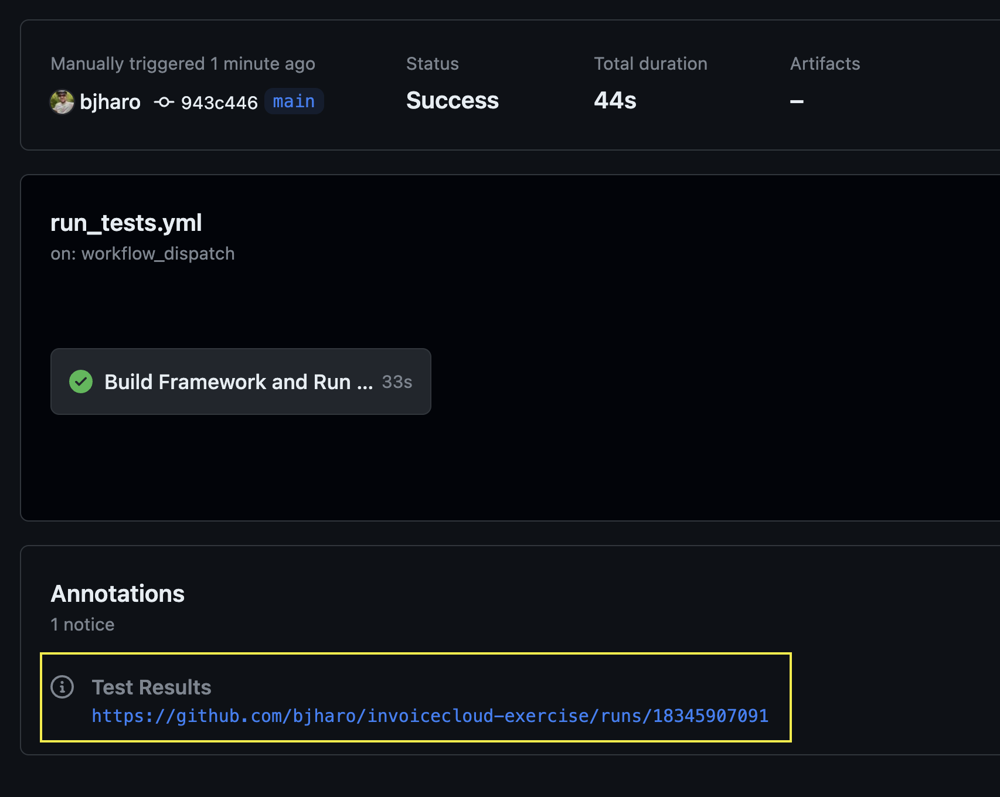

# Selenium Exercise for InvoiceCloud

## Requirements (Local Execution)

- macOS Sonoma or Windows 11
    - _Older versions may work but they have not been tested._
- Chrome
    - The browser needs to be installed in its default location for the OS you are using.
    - The browser needs to be updated to the most current stable version available.
- .NET SDK 7
    - Can be downloaded [here](https://dotnet.microsoft.com/en-us/download/dotnet/7.0).
    - If you are using macOS and Brew, install it with `brew install --cask dotnet-sdk`
    - If you are using Windows and Chocolately, install it with `choco install dotnet-7.0-sdk`

## Executing Tests

### Running in Github Actions

1. Go to the [Actions page](https://github.com/bjharo/invoicecloud-exercise/actions) for this repository.
2. In the Actions column on the left, click _Run Selenium Tests_.
3. On the right-hand side of the page, locate the _Run Workflow_ dropdown button. Click it.
4. In the small pop-up, click the green _Run workflow_ button.
5. Wait a few moments for the new workflow run to show up on the page.
6. Click the run that shows up.
7. Wait for the run to complete. If the run executed successfully, a link to a 
test report will appear as shown in this screenshot.

### Running Locally

1. Clone this repository to your local machine.
2. Open a terminal and go to the folder where you cloned this repository.
3. Execute tests using one of the following commands:
    1. `dotnet test` - Runs all tests in a visible browser window(s).
    2. `dotnet test -e AUTOMATION_HEADLESS=true` - Runs all tests in headless mode (no visible window)

Be default, up to two tests will run in parallel. You can adjust how many tests run in parallel by
appending `-- NUnit.NumberOfTestWorkers=#` and replace `#` with how many tests you want to run in parallel.

For example, `dotnet test -- NUnit.NumberOfTestWorkers=3` will run up to three tests at a time.

Setting the number of parallel tests too high could result in unexpected test failures.

#### Viewing a Local Test Report

After a test run is completed, a very basic test report is generated. This report is named `TestResults.html`
and is placed in the `Tests/bin/Debug/results` folder. The path to the report is also displayed in the 
terminal window at the end of the test run. This report can be opened in a browser of your choice.